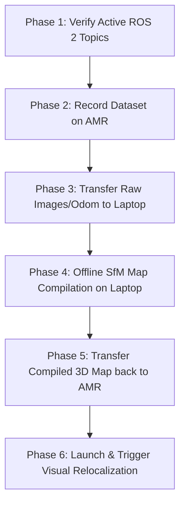

# Remapping & Offline Map Compilation Guide

This document outlines the step-by-step process for recording new imagery and odometry data on the AMR, transferring it to an external laptop for offline high-performance 3D map compilation (SfM), transferring the finished map back to the AMR, and launching the localized visual recovery safety system.

---

## Complete Workflow Overview



---

## Phase 1: Verify Active ROS 2 Topics on the Robot

Before starting the recorder, the robot's hardware and driver nodes must be running and active.

1. SSH into the robot or open a terminal window.
2. Verify the required data topics are currently broadcasting:
   ```bash
   ros2 topic list
   ```
3. Confirm that the following two topics are listed and producing active streams:
   * **Odometry:** `/odom` (type: `nav_msgs/msg/Odometry`)
   * **Camera Image:** `/image_raw` (type: `sensor_msgs/msg/Image`)

---

## Phase 2: Record the Image Dataset on the Robot

Using the built-in dataset recorder, drive the robot to capture the mapping frames.

1. Start the recording node, specifying a **new unique output directory** so you do not overwrite previous datasets:
   ```bash
   ros2 run visual_robot_localization record_dataset.py --ros-args \
       -p output_dir:=/home/smr/workspaces/mini_amr/amrROS2_ws/src/visual_robot_localization/test/new_image_dataset
   ```
   > [!TIP]
   > You can optionally adjust the frequency of the frames taken by passing `record_interval_sec` (default is `1.0` second):
   > ```bash
   > -p record_interval_sec:=0.5
   > ```

2. **Teleoperate/Drive the Robot:**
   * Steer the robot **very slowly** to prevent motion blur on the camera frames.
   * **CRITICAL REQUIREMENT:** Capture the environment from **multiple orientations and headings**. Drive in loops and traverse the paths forward and backward. If the robot gets lost pointing in a specific direction, the 3D map must contain matching visual reference points taken from that exact direction.
   * Avoid making sharp, sudden rotations during recording.

3. **Stop Recording:**
   * Once you have fully traversed the environment, press `Ctrl + C` in the recorder terminal to terminate safely.
   * Verify files exist: Check that `/home/smr/workspaces/mini_amr/amrROS2_ws/src/visual_robot_localization/test/new_image_dataset/` contains `.png` images and matching `.json` odometry records.

---

## Phase 3: Transfer Raw Dataset to the External Laptop

Make sure both the AMR and external laptop are on the same Wi-Fi network.

1. Find the robot's current IP address by running `hostname -I` on the robot's terminal.
2. Open a terminal on the **External Laptop** and run `rsync` to pull the raw image dataset:
   ```bash
   rsync -avz --progress smr@<ROBOT_IP>:/home/smr/workspaces/mini_amr/amrROS2_ws/src/visual_robot_localization/test/new_image_dataset/ /home/piek/Desktop/new_image_dataset/
   ```

---

## Phase 4: Compile the 3D Map Offline on the Laptop

Since the AMR hardware (ARM64) is resource-constrained, compiling the 3D visual reconstruction requires a high-performance desktop or laptop computer.

1. On the **External Laptop**, navigate to your `hloc` matching script environment.
2. Run your pipeline compiler script (`do_SfM.sh` or standard hloc script) pointing to the raw imagery:
   ```bash
   ./do_SfM.sh --dataset_path /home/piek/Desktop/new_image_dataset
   ```
   
   Under the hood, the offline compiler executes the following pipeline:
   * **Global Feature Extraction:** Uses NetVLAD to extract unique image-wide descriptors.
   * **Local Feature Extraction:** Uses SuperPoint to identify precise local corners and keypoints.
   * **Feature Matching:** Uses SuperGlue to match identical points across overlapping views.
   * **Reconstruction:** Uses COLMAP to perform 3D triangulation, generating a sparse 3D point cloud of the mapped area.

3. Verify that the outputs have successfully compiled inside `/home/piek/Desktop/new_image_dataset/outputs/`. You should see:
   * `global-feats-netvlad.h5`
   * `feats-superpoint-n4096-r1024.h5`
   * A sparse point cloud directory: `sfm_netvlad+superpoint_aachen+superglue/` (containing `.bin` or `.txt` camera structures).

---

## Phase 5: Send Compiled Map back to the Robot

Send only the processed outputs back to the AMR to conserve disk space.

1. From the **External Laptop**, push the generated model directory back to the robot via the same local IP:
   ```bash
   rsync -avz --progress /home/piek/Desktop/new_image_dataset/outputs/ smr@<ROBOT_IP>:/home/smr/workspaces/mini_amr/amrROS2_ws/src/visual_robot_localization/test/new_image_dataset/outputs/
   ```

---

## Phase 6: Launch & Trigger Visual Relocalization on the AMR

Now that the map has been updated, you can run the localized recovery node.

1. In a terminal on the **Robot**, execute the launch command pointing to your new mapping database paths:
   ```bash
   ros2 launch visual_recovery relocalization_system.launch.py \
       image_gallery_path:=/home/smr/workspaces/mini_amr/amrROS2_ws/src/visual_robot_localization/test/new_image_dataset/ \
       gallery_global_descriptor_path:=/home/smr/workspaces/mini_amr/amrROS2_ws/src/visual_robot_localization/test/new_image_dataset/outputs/netvlad+superpoint_aachen+superglue/global-feats-netvlad.h5 \
       gallery_local_descriptor_path:=/home/smr/workspaces/mini_amr/amrROS2_ws/src/visual_robot_localization/test/new_image_dataset/outputs/netvlad+superpoint_aachen+superglue/feats-superpoint-n4096-r1024.h5 \
       gallery_sfm_path:=/home/smr/workspaces/mini_amr/amrROS2_ws/src/visual_robot_localization/test/new_image_dataset/outputs/netvlad+superpoint_aachen+superglue/sfm_netvlad+superpoint_aachen+superglue
   ```

2. **Trigger Safety Recovery:**
   If the robot's localization fails or drifts, run this command in a new robot terminal to trigger the localization pipeline on-demand:
   ```bash
   ros2 service call /visual_recovery_node/trigger_recovery std_srvs/srv/Trigger
   ```
   The AMR will halt automatically, capture a live camera frame, match it against your newly compiled offline 3D database, extract 6-DOF coordinates, and update your autonomous navigation stack!
