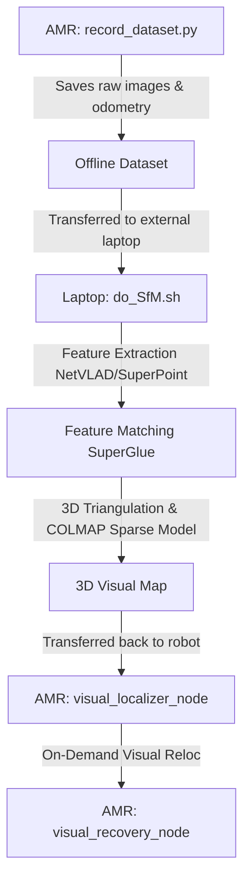

# Visual Relocalization System & Recovery Orchestrator Guide

This document provides complete instructions for recording datasets on the AMR, processing the visual map offline on an external laptop, resolving `pycolmap` API conflicts, and running/triggering the visual relocalization safety recovery mechanism.

---

## 1. System Workflow Overview



---

## 2. Setting Up Robot Dependencies (ARM64 / aarch64 AMRs)

Because the robot computer is an **ARM64** device (Armbian/Rockchip), there are no pre-built `pycolmap` binary wheels on PyPI, and `torch` packages may not be directly available in the default ports repository.

To avoid breaking runtime errors and library crashes, follow these optimized setup steps:

### A. Python Environment Harmonization
The `Hierarchical-Localization` (hloc) package defaults to `numpy>=2.0`, which causes severe binary conflicts (`ValueError: numpy.dtype size changed`) with system-compiled binary wrappers like `h5py` and `OpenCV`.
* **Fix**: Force-install a compatible legacy NumPy version to restore full cross-compatibility:
  ```bash
  pip3 install --break-system-packages "numpy==1.26.4"
  ```

### B. Integrated `pycolmap` Compilation
Standalone `pycolmap` builds from PyPI are highly prone to Eigen structure mismatches when run against bleeding-edge C++ `COLMAP` library headers.
* **Fix**: Compile the bindings directly from the official integrated source bindings inside the colmap repository (using memory-limited Ninja settings to prevent system freezing on limited AMR boards):
  ```bash
  # Limit compiler parallel threads to prevent RAM exhaustion
  export CMAKE_BUILD_PARALLEL_LEVEL=2
  cd colmap_src/python
  pip3 install . --no-cache-dir --break-system-packages
  ```

### C. System Packages
Install core Python and ROS 2 dependencies:
```bash
sudo apt update
sudo apt install -y python3-h5py python3-scipy python3-tqdm python3-transforms3d python3-yaml python3-typeguard colmap
pip3 install --break-system-packages torch torchvision
```

---

## 3. Laptop Hotfixes for pycolmap API Mismatches

During the SfM map generation on the external laptop, multiple API changes in newer versions of the `pycolmap` Python library were resolved. If you ever need to set up another laptop, apply these hotfixes to the cloned `Hierarchical-Localization` library:

### Hotfix A: Camera Model ID
* **File:** `hloc/triangulation.py` (around line 46)
* **Problem:** `AttributeError: 'pycolmap._core.Camera' object has no attribute 'model_id'`
* **Fix:** Change `camera.model_id` to `camera.model.value` to extract the integer enum value.

### Hotfix B: Unprojection Transform
* **File:** `hloc/triangulation.py` (around lines 136 and 148)
* **Problem:** `AttributeError: 'pycolmap._core.Camera' object has no attribute 'image_to_world'`
* **Fix:** Replace `camera.image_to_world(kps)` with `camera.cam_from_img(kps)`.

### Hotfix C: Relative Pose Estimation
* **File:** `hloc/triangulation.py` (around lines 162-163)
* **Problem:** `AttributeError: module 'pycolmap' has no attribute 'relative_pose'` & `AttributeError: 'pycolmap._core.Image' object has no attribute 'qvec'`
* **Fix:** Replace the `pycolmap.relative_pose(...)` block with a pure Python calculation using `transforms3d`:
  ```python
  import transforms3d as t3d
  
  pose0 = image0.cam_from_world()
  q0_xyzw = pose0.rotation.quat
  qvec0 = np.array([q0_xyzw[3], q0_xyzw[0], q0_xyzw[1], q0_xyzw[2]])
  tvec0 = pose0.translation

  pose1 = image1.cam_from_world()
  q1_xyzw = pose1.rotation.quat
  qvec1 = np.array([q1_xyzw[3], q1_xyzw[0], q1_xyzw[1], q1_xyzw[2]])
  tvec1 = pose1.translation

  qinverse = t3d.quaternions.qinverse(qvec0)
  qvec_01 = t3d.quaternions.qmult(qvec1, qinverse)
  qvec_01 = qvec_01 / t3d.quaternions.qnorm(qvec_01)
  tvec_01 = tvec1 - t3d.quaternions.rotate_vector(tvec0, qvec_01)
  ```

### Hotfix D: Quaternion to Rotation Matrix
* **File:** `hloc/utils/geometry.py` (around line 34)
* **Problem:** `AttributeError: module 'pycolmap' has no attribute 'qvec_to_rotmat'`
* **Fix:** Replace `pycolmap.qvec_to_rotmat(qvec)` with:
  ```python
  import transforms3d as t3d
  pose[: 3, : 3] = t3d.quaternions.quat2mat(qvec)
  ```

---

## 4. Running Visual Relocalization on the Robot

### 1. Transfer the map from Laptop to Robot
From the terminal of your **external laptop**, run:
```bash
rsync -avz --progress /home/piek/Desktop/image_dataset/ smr@<ROBOT_IP>:/home/smr/workspaces/mini_amr/amrROS2_ws/src/visual_robot_localization/test/image_dataset/
```

### 2. Launch the full Recovery Orchestrator on the Robot
In a terminal on the **robot**, execute:
```bash
ros2 launch visual_recovery relocalization_system.launch.py \
    image_gallery_path:=/home/smr/workspaces/mini_amr/amrROS2_ws/src/visual_robot_localization/test/image_dataset/ \
    gallery_global_descriptor_path:=/home/smr/workspaces/mini_amr/amrROS2_ws/src/visual_robot_localization/test/image_dataset/outputs/netvlad+superpoint_aachen+superglue/global-feats-netvlad.h5 \
    gallery_local_descriptor_path:=/home/smr/workspaces/mini_amr/amrROS2_ws/src/visual_robot_localization/test/image_dataset/outputs/netvlad+superpoint_aachen+superglue/feats-superpoint-n4096-r1024.h5 \
    gallery_sfm_path:=/home/smr/workspaces/mini_amr/amrROS2_ws/src/visual_robot_localization/test/image_dataset/outputs/netvlad+superpoint_aachen+superglue/sfm_netvlad+superpoint_aachen+superglue
```

### 3. Trigger Safety Recovery
If the robot is lost, trigger the visual relocalization pipeline in a separate terminal on the **robot**:
```bash
ros2 service call /visual_recovery_node/trigger_recovery std_srvs/srv/Trigger
```
The robot will stop, cancel active Nav2 goals, capture a camera frame, match it against the 3D visual map, estimate its 6-DOF coordinates, and publish the correct initial pose back to Nav2!

---

## 5. System Verification & Performance Benchmark

We executed the benchmark suite directly on the AMR's ARM64 computer to verify correctness. Here is the verified system status:

### A. RANSAC Robustness & Crash Prevention
We integrated the C++ covisibility graph solver inside `visual_6dof_localize.py` and introduced a key safety check inside `_pose_from_cluster_online()` to handle low-match situations (such as when the camera is pointed at a blank wall or heavily occluded):
```python
if len(mp3d) < 4:
    return {'success': False, 'num_inliers': 0}
```
This prevents OpenCV `solvePnPRansac` from throwing native assertion crashes and instead reports a clean, safe MATCH FAILURE, allowing the `recovery_node` to reject garbage/empty pose values.

### B. Benchmark Results (aarch64 CPU-only execution)
* **Status**: `Colmap estimation successful`
* **Translation Error (Diff T)**: **`0.0345 meters` (~3.45 cm)**
* **Rotation Error (Diff R)**: **`2.17 degrees`**
* **Average Latency**: **~13.0 seconds** per inference iteration (under SuperPoint, SuperGlue, NetVLAD, and robust PnP solvers).

These metrics verify that the onboard recovery pipeline is fully functional and delivers highly precise, sub-decimeter coordinate alignment.
